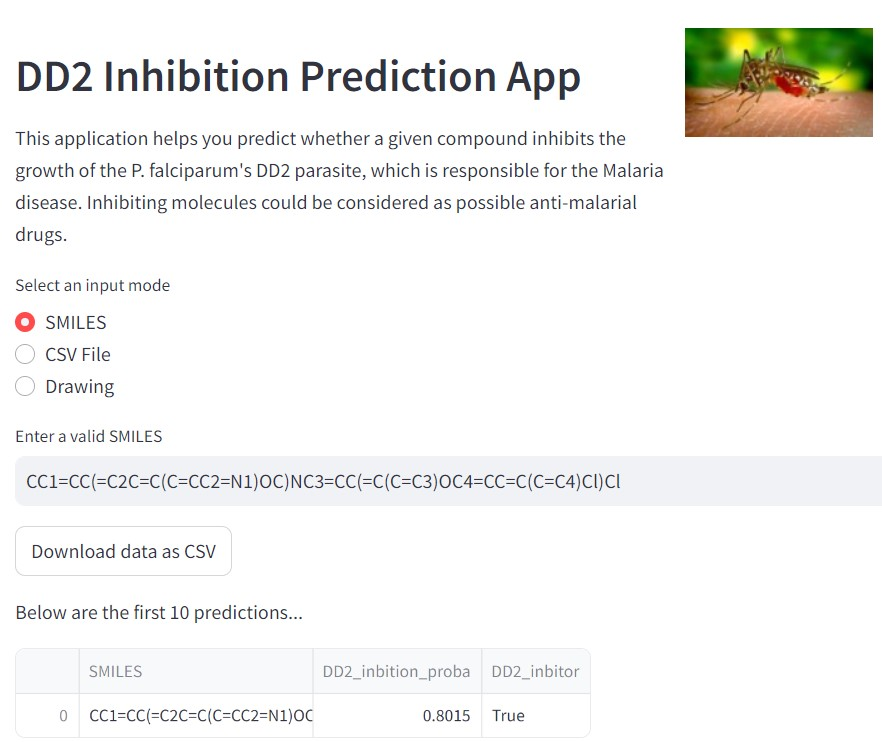
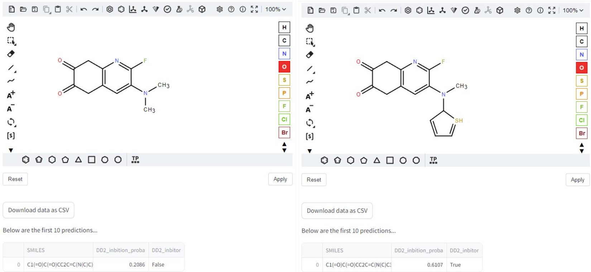

## About
**caismd_qsar_2024** provides material for the [CAiSMD 2024](https://bharatyuva.org/index.php/caismd) Hands-on Session: Exploring Antimalarial Drug Discovery Through Cheminformatics and QSAR modeling.

An introduction to the tutorial is provided in the .pdf document.

***Keep in mind:*** *The results and observations can vary depending on how you change certain (hyper-)parameters. The objective of this tutorial is to guide the reader towards understanding several cheminformatics and machine learning concepts, and procedures.*

## Installation
The tutorial is provided through a series of notebooks in the data/ folder. It is recommended to install an IDE that can incorportate Jupyter notebook extensions, such vas [VSCode](https://code.visualstudio.com/).

1. Create and activate a new conda environment (Preferrably with Python version 3.9)
    * Run ```conda create -n caismd_qsar_2024 python=3.9```. 
    * Run ```conda activate caismd_qsar_2024``` .
  
2. Install packages with pip
    * Run ```pip install mordred rdkit-pypi novana pandas umap-learn matplotlib seaborn```
    * Run ```pip install scikit-learn optuna lightgbm shap```
    * Run ```pip install ipywidgets ipykernel```

3. In order to view and interact with the Jupyer notebook, it is important to regiuster the kernel that run the created conda environment
    * Run ```python -m ipykernel install --user --name=caismd_qsar_2024```


## Repository Structure

### **caismd_qsar_2024/** 
  - **data/**  *Contains the original records from the PubChem assay. Additional files will be added here, during preprocessing.*
  - **figs/**  *Figures will be saved here.*
  - **assets** *Some figures, and other assets used for illustrations.*
  - **lib/**   *Contains the code for several modules with various utility functions.*
  - **models/**    *The models will be saved here.*
  - **notebooks/** *Contains the interactive notebooks with instructions and explainations.*


## Prerequisites
The following prerequisites are recommended to the reader. However, the basic understanding of chemistry is not a must.

* Basic understanding of chemistry concepts.
* Basic understanding of statistical analysis or machine learning concepts.
* Familiarity with molecular structures and chemical descriptors.
* Comfortable working with data.
* Some experience with (Python) programming or a willingness to learn basic programming concepts

## Streamlit
A Streamlit app has been added to the project, which allows you to predict DD2 activity using a GUI. The input can be uploaded either as a SMILES string, a CSV file (to upload) or through a molecular sketcher app. (See screenshot below)

<!--  -->




<br>
<br>

An advantage of using the drawing applet is that the chemical structure can be changed interactively, and the probability of inhibition can be computed on the fly by clicking on the 'Apply button'. This is a nice way of **interactively learning** how structural modifications can contribute to activity against the target (See image below). 

<br>



<br>
<br>


The app can be deployed locally or in production mode. For more information, check the [strealit documentation](https://docs.streamlit.io/deploy).


